# Xteink X3 Somatic Reset Wallpapers

I made this because I wanted to take advantage of the X3's E-ink screen on the back of my phone to actually learn and practice these somatic exercises.

I kept saving infographics and Reddit posts about nervous system resets, telling myself I would practice them later. But when I actually felt keyed up or stressed, I never went digging through saved posts or opened an app.

The Xteink X3 sits magnetically on the back of my phone. The screen stays on all day without using battery. By turning these exercises into wallpapers, the back of my phone becomes a practice deck. Every time I put my phone down or flip it over at my desk, there is a quick physical reset right in front of me.

Here are 16 cards formatted specifically for the 3.7-inch screen (528 &times; 792 pixels, 24-bit uncompressed BMP).

<p align="center">
  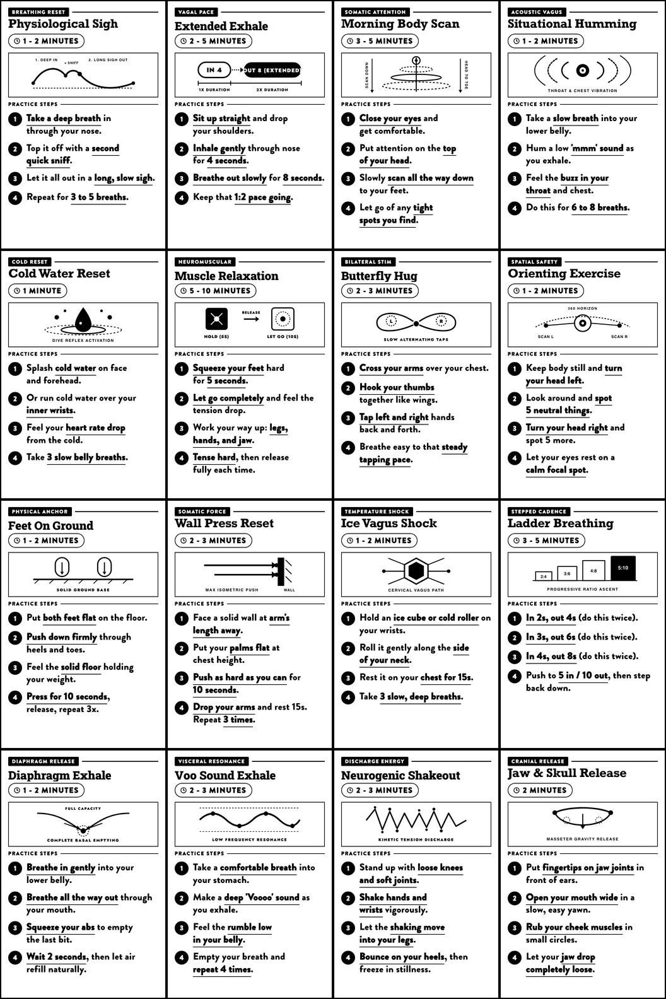
</p>

---

## How it works on the device

I designed these specifically for the small 3.7-inch display:
* **Large text:** 31px font with key action steps bolded and underlined so you can read and follow the steps in 5 seconds without squinting.
* **Locked lines:** Numbers and units stay together on one line (like `10 seconds` or `4 times`) with no orphan words.
* **Clean vector art:** Bold diagrams with clear labels so you understand the physical movement at a glance.
* **Exact resolution:** 528 &times; 792 pixels. 24-bit uncompressed BMP. Zero scaling artifacts or fuzzy text on E-ink.

---

## How to install on your X3 (CrossPoint Reader)

### 1. Download the files
Grab the pre-built wallpaper zip from the [Releases page](https://github.com/nerveband/xteink-x3-somatic-cards/releases) (`x3_somatic_cards_v1.0.0.zip`), or copy the `.bmp` files straight from the [`bmp/`](bmp/) folder in this repo.

### 2. Put them on your MicroSD card
Insert your FAT32-formatted microSD card into your computer:

* **To cycle wallpapers automatically on sleep (CrossPoint Reader):**
  Create a folder named `.sleep` in the root of your SD card and copy the BMP files inside. CrossPoint will pick a random exercise wallpaper every time the reader goes to sleep:
  ```
  SD_CARD/
  └── .sleep/
      ├── 01_physiological_sigh.bmp
      ├── 02_extended_exhale.bmp
      ├── 03_morning_body_scan.bmp
      └── ...
  ```

* **To keep them in a manual folder:**
  Create a folder named `somatic` or `wallpapers` on your SD card and copy the files there:
  ```
  SD_CARD/
  └── somatic/
      ├── 01_physiological_sigh.bmp
      ├── 02_extended_exhale.bmp
      └── ...
  ```

Put the card back in your X3 and you are ready.

---

## Wallpaper roster

| # | Exercise Name | Category | Duration | BMP File |
|---|---|---|---|---|
| **01** | **Physiological Sigh** | `BREATHING RESET` | `1 - 2 MINUTES` | [`01_physiological_sigh.bmp`](bmp/01_physiological_sigh.bmp) |
| **02** | **Extended Exhale** | `VAGAL PACE` | `2 - 5 MINUTES` | [`02_extended_exhale.bmp`](bmp/02_extended_exhale.bmp) |
| **03** | **Morning Body Scan** | `SOMATIC ATTENTION` | `3 - 5 MINUTES` | [`03_morning_body_scan.bmp`](bmp/03_morning_body_scan.bmp) |
| **04** | **Situational Humming** | `ACOUSTIC VAGUS` | `1 - 2 MINUTES` | [`04_situational_humming.bmp`](bmp/04_situational_humming.bmp) |
| **05** | **Cold Water Reset** | `COLD RESET` | `1 MINUTE` | [`05_cold_water_reset.bmp`](bmp/05_cold_water_reset.bmp) |
| **06** | **Muscle Relaxation** | `NEUROMUSCULAR` | `5 - 10 MINUTES` | [`06_muscle_relaxation.bmp`](bmp/06_muscle_relaxation.bmp) |
| **07** | **Butterfly Hug** | `BILATERAL STIM` | `2 - 3 MINUTES` | [`07_butterfly_hug.bmp`](bmp/07_butterfly_hug.bmp) |
| **08** | **Orienting Exercise** | `SPATIAL SAFETY` | `1 - 2 MINUTES` | [`08_orienting_exercise.bmp`](bmp/08_orienting_exercise.bmp) |
| **09** | **Feet On Ground** | `PHYSICAL ANCHOR` | `1 - 2 MINUTES` | [`09_feet_on_ground.bmp`](bmp/09_feet_on_ground.bmp) |
| **10** | **Wall Press Reset** | `SOMATIC FORCE` | `2 - 3 MINUTES` | [`10_wall_press_reset.bmp`](bmp/10_wall_press_reset.bmp) |
| **11** | **Ice Vagus Shock** | `TEMPERATURE SHOCK` | `1 - 2 MINUTES` | [`11_ice_vagus_shock.bmp`](bmp/11_ice_vagus_shock.bmp) |
| **12** | **Ladder Breathing** | `STEPPED CADENCE` | `3 - 5 MINUTES` | [`12_ladder_breathing.bmp`](bmp/12_ladder_breathing.bmp) |
| **13** | **Diaphragm Exhale** | `DIAPHRAGM RELEASE` | `1 - 2 MINUTES` | [`13_diaphragm_exhale.bmp`](bmp/13_diaphragm_exhale.bmp) |
| **14** | **Voo Sound Exhale** | `VISCERAL RESONANCE` | `2 - 3 MINUTES` | [`14_voo_sound_exhale.bmp`](bmp/14_voo_sound_exhale.bmp) |
| **15** | **Neurogenic Shakeout** | `DISCHARGE ENERGY` | `2 - 3 MINUTES` | [`15_neurogenic_shakeout.bmp`](bmp/15_neurogenic_shakeout.bmp) |
| **16** | **Jaw & Skull Release** | `CRANIAL RELEASE` | `2 MINUTES` | [`16_jaw_skull_release.bmp`](bmp/16_jaw_skull_release.bmp) |

---

## Visual Gallery

### 01. Physiological Sigh
* **Category:** `BREATHING RESET`
* **Duration:** `1 - 2 MINUTES`
* **File:** [`bmp/01_physiological_sigh.bmp`](bmp/01_physiological_sigh.bmp)

<p align="center">
  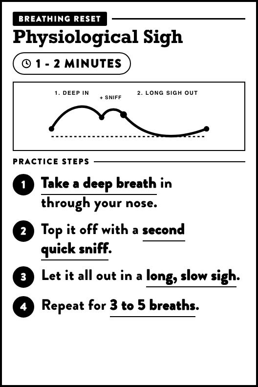
</p>

---

### 02. Extended Exhale
* **Category:** `VAGAL PACE`
* **Duration:** `2 - 5 MINUTES`
* **File:** [`bmp/02_extended_exhale.bmp`](bmp/02_extended_exhale.bmp)

<p align="center">
  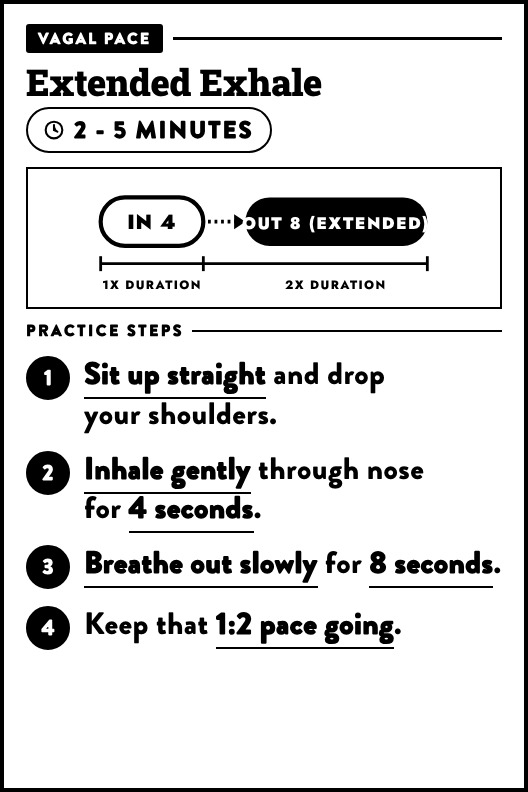
</p>

---

### 03. Morning Body Scan
* **Category:** `SOMATIC ATTENTION`
* **Duration:** `3 - 5 MINUTES`
* **File:** [`bmp/03_morning_body_scan.bmp`](bmp/03_morning_body_scan.bmp)

<p align="center">
  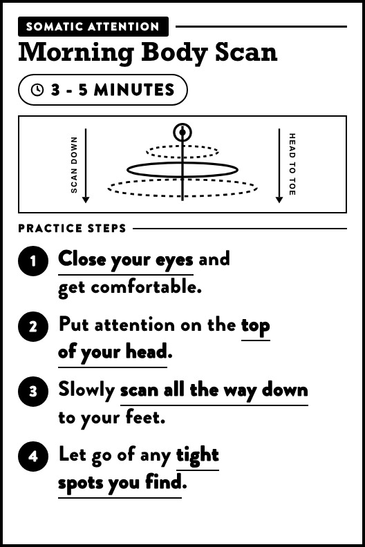
</p>

---

### 04. Situational Humming
* **Category:** `ACOUSTIC VAGUS`
* **Duration:** `1 - 2 MINUTES`
* **File:** [`bmp/04_situational_humming.bmp`](bmp/04_situational_humming.bmp)

<p align="center">
  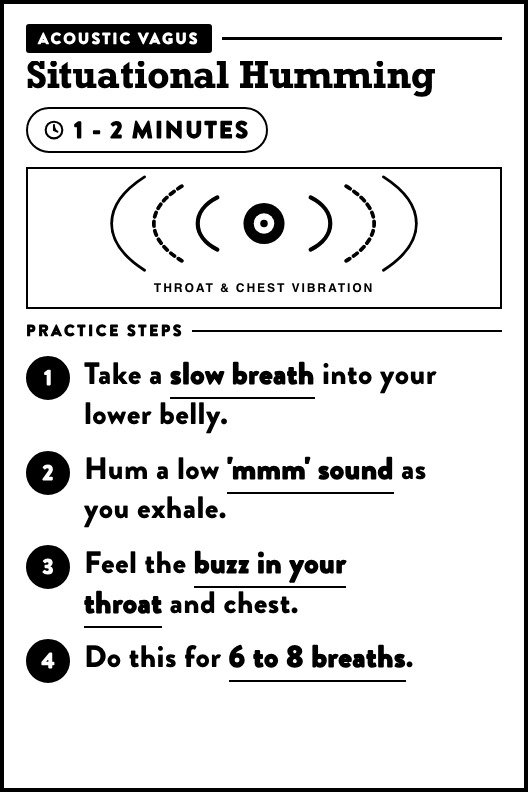
</p>

---

### 05. Cold Water Reset
* **Category:** `COLD RESET`
* **Duration:** `1 MINUTE`
* **File:** [`bmp/05_cold_water_reset.bmp`](bmp/05_cold_water_reset.bmp)

<p align="center">
  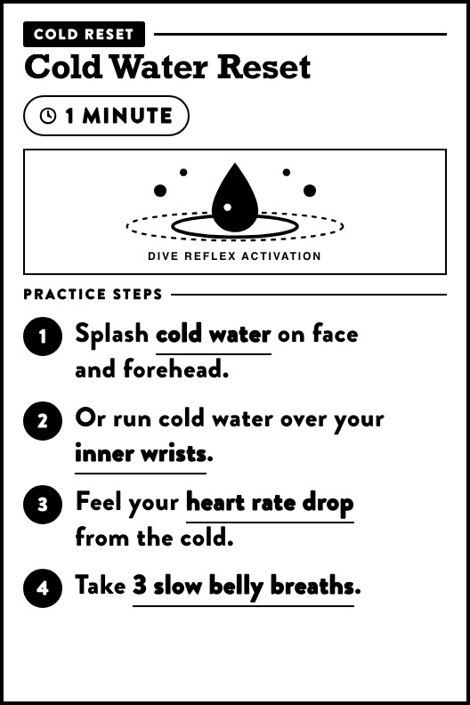
</p>

---

### 06. Muscle Relaxation
* **Category:** `NEUROMUSCULAR`
* **Duration:** `5 - 10 MINUTES`
* **File:** [`bmp/06_muscle_relaxation.bmp`](bmp/06_muscle_relaxation.bmp)

<p align="center">
  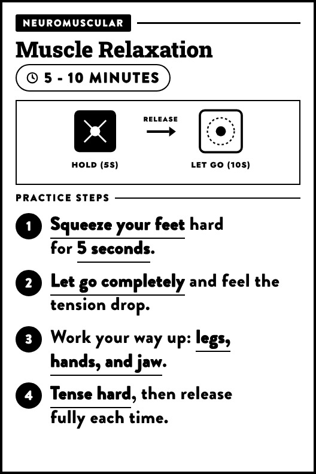
</p>

---

### 07. Butterfly Hug
* **Category:** `BILATERAL STIM`
* **Duration:** `2 - 3 MINUTES`
* **File:** [`bmp/07_butterfly_hug.bmp`](bmp/07_butterfly_hug.bmp)

<p align="center">
  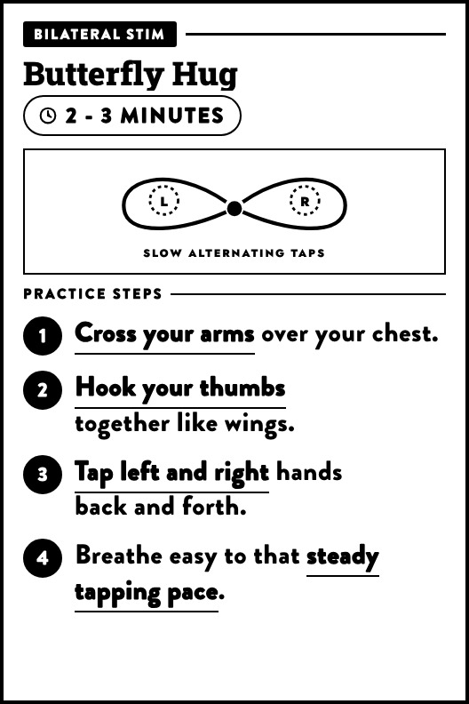
</p>

---

### 08. Orienting Exercise
* **Category:** `SPATIAL SAFETY`
* **Duration:** `1 - 2 MINUTES`
* **File:** [`bmp/08_orienting_exercise.bmp`](bmp/08_orienting_exercise.bmp)

<p align="center">
  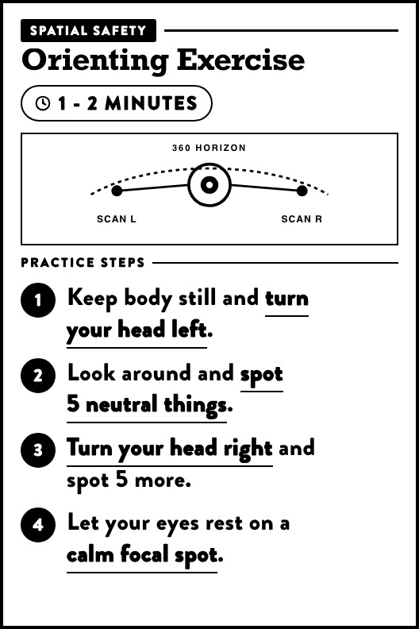
</p>

---

### 09. Feet On Ground
* **Category:** `PHYSICAL ANCHOR`
* **Duration:** `1 - 2 MINUTES`
* **File:** [`bmp/09_feet_on_ground.bmp`](bmp/09_feet_on_ground.bmp)

<p align="center">
  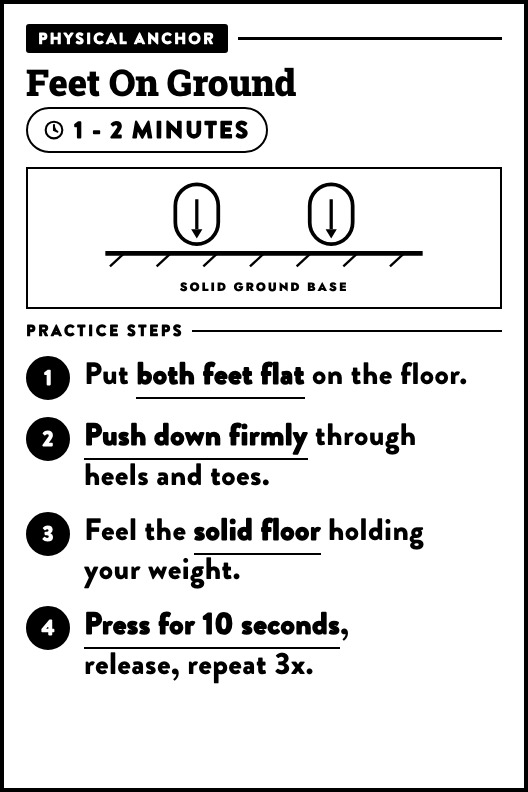
</p>

---

### 10. Wall Press Reset
* **Category:** `SOMATIC FORCE`
* **Duration:** `2 - 3 MINUTES`
* **File:** [`bmp/10_wall_press_reset.bmp`](bmp/10_wall_press_reset.bmp)

<p align="center">
  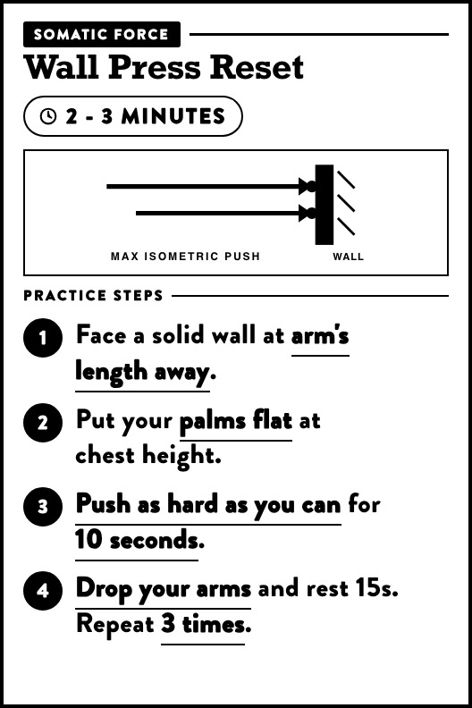
</p>

---

### 11. Ice Vagus Shock
* **Category:** `TEMPERATURE SHOCK`
* **Duration:** `1 - 2 MINUTES`
* **File:** [`bmp/11_ice_vagus_shock.bmp`](bmp/11_ice_vagus_shock.bmp)

<p align="center">
  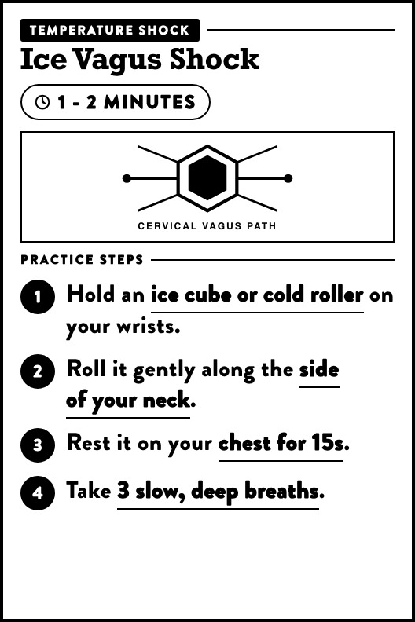
</p>

---

### 12. Ladder Breathing
* **Category:** `STEPPED CADENCE`
* **Duration:** `3 - 5 MINUTES`
* **File:** [`bmp/12_ladder_breathing.bmp`](bmp/12_ladder_breathing.bmp)

<p align="center">
  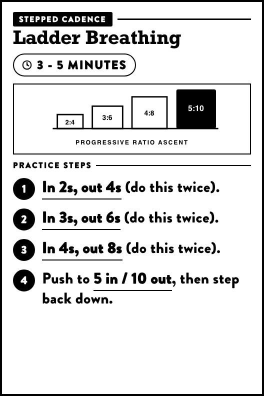
</p>

---

### 13. Diaphragm Exhale
* **Category:** `DIAPHRAGM RELEASE`
* **Duration:** `1 - 2 MINUTES`
* **File:** [`bmp/13_diaphragm_exhale.bmp`](bmp/13_diaphragm_exhale.bmp)

<p align="center">
  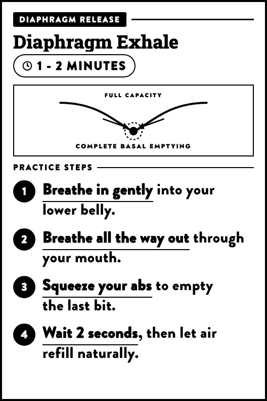
</p>

---

### 14. Voo Sound Exhale
* **Category:** `VISCERAL RESONANCE`
* **Duration:** `2 - 3 MINUTES`
* **File:** [`bmp/14_voo_sound_exhale.bmp`](bmp/14_voo_sound_exhale.bmp)

<p align="center">
  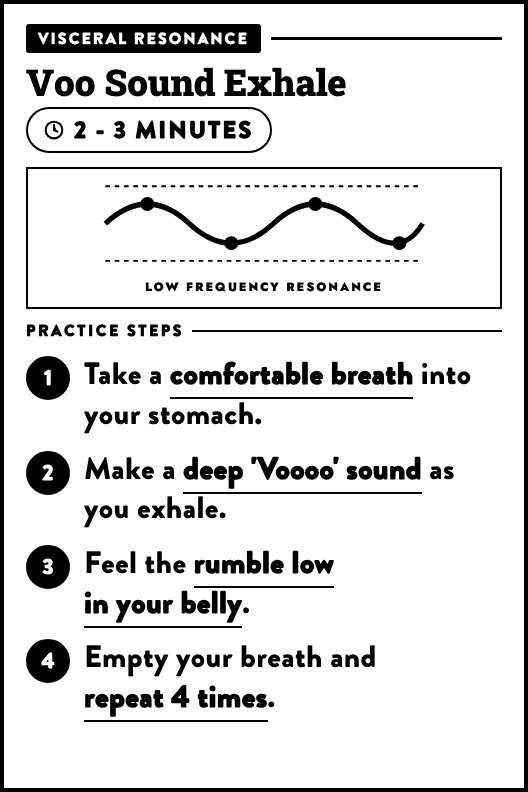
</p>

---

### 15. Neurogenic Shakeout
* **Category:** `DISCHARGE ENERGY`
* **Duration:** `2 - 3 MINUTES`
* **File:** [`bmp/15_neurogenic_shakeout.bmp`](bmp/15_neurogenic_shakeout.bmp)

<p align="center">
  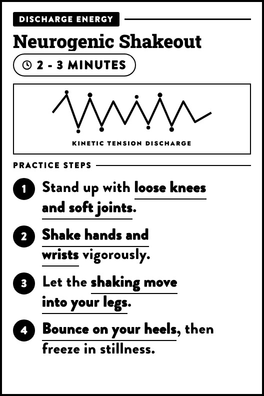
</p>

---

### 16. Jaw & Skull Release
* **Category:** `CRANIAL RELEASE`
* **Duration:** `2 MINUTES`
* **File:** [`bmp/16_jaw_skull_release.bmp`](bmp/16_jaw_skull_release.bmp)

<p align="center">
  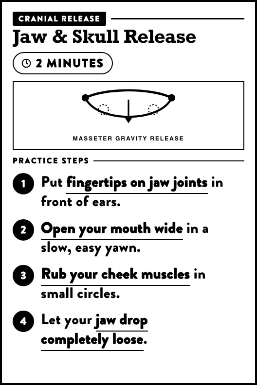
</p>

---

## Building and editing

All HTML source files, diagrams, and python rasterization scripts are included.

### Requirements
* Python 3.9+
* Pillow (`pip install pillow`)
* Google Chrome (used for headless vector and font rasterization)

### Commands

```bash
# Build HTML templates in src/
python3 build_cards.py

# Render 24-bit uncompressed BMPs and JPG previews
python3 export_bmp.py

# Run automated visual layout checks
python3 inspect_cards.py
```

### Local browser previewer
To flip through the cards in your browser:
```bash
python3 -m http.server 8899 --directory .
# Open http://localhost:8899/viewer/index.html in your browser
```

---

## License

MIT. Feel free to use, share, or edit however you want.
